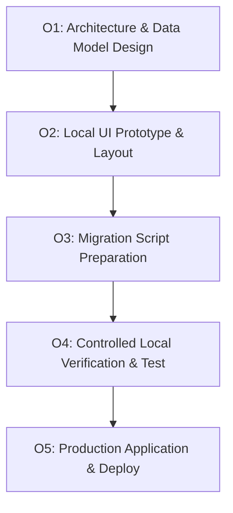

# O1 — Implementation & Rollout Plan

**Document Version:** 1.0.0  
**Phase:** Paket O1 — Operasyon Merkezi Temeli ve Stok Modülü Tasarımı  
**Target Application:** HurCELL Operasyon Merkezi (`/admin/operations`)

---

## 1. Phase Breakdown & Execution Roadmap

### Phase O1 (Current Phase): Architecture & Design
- ✅ Architecture Audit (`O1_CURRENT_ARCHITECTURE_AUDIT.md`)
- ✅ Route & Screen Map (`O1_ROUTE_AND_SCREEN_MAP.md`)
- ✅ Data Model Plan (`O1_DATA_MODEL_PLAN.md`)
- ✅ Implementation & Rollout Plan (`O1_IMPLEMENTATION_PLAN.md`)

### Phase O2 (Next Phase): Local UI & Screen Foundation
- Design responsive collapsable Operations Layout inside `web/src/app/admin/operations/layout.tsx`.
- Implement Stock & Accessory Management UI (`/admin/operations/stock`).
- Build Stock Movement History & Product Form.
- Implement Critical Stock Alerts and Filter Controls (WhatsApp visible, Web visible, Accessory Categories).

---

## 2. Verification Plan

### Automated Checks (Local)
- `npx eslint src/app/admin/operations/**`
- `npx tsc --noEmit`
- `npm run build`

### Manual Verification
- Verify Sidebar navigation across Desktop and Mobile viewports.
- Confirm PII masking on customer phone numbers (`905*****1234`).
- Validate that no direct mutation occurs without movement ledger logging.

---

## 3. Strict Safety & Guardrail Declaration

- **No Production DB Write:** Zero DML or DDL executed on production database in this phase.
- **No Production Deploy:** Zero deployments performed.
- **No Secret Alterations:** Environment variables remain untouched.
- **No SMS / Real Transactions:** Zero live SMS or orders executed.
